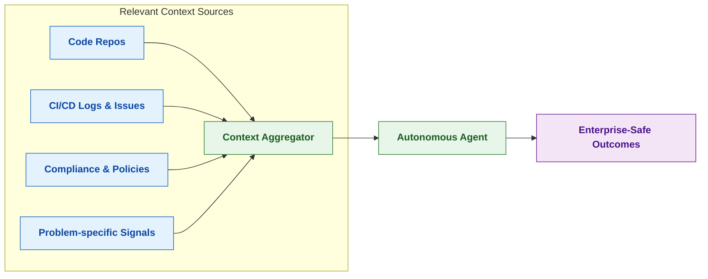

# **Enterprise GenAI Stack**

*A Reference Library for Applying Generative AI to the Software Development Lifecycle (SDLC) in Enterprise Environments*

---

## **Mission**

The **Enterprise GenAI Stack** exists to help large organizations adopt **secure, scalable, and context-aware generative AI solutions** across the SDLC.

This repository documents **best practices, reusable patterns, and proven architectures** from real-world rollouts in highly regulated environments, where source code is the crown jewel and compliance is non-negotiable.

Our mission is simple:
Enable enterprises to **move beyond pilots** and implement **sustainable GenAI platforms** that accelerate delivery while safeguarding security and regulatory requirements.

---

## **Core Principles**

1. **Context is Everything** – AI output quality depends on high-quality context aggregation pipelines.
2. **Autonomy with Guardrails** – Autonomous agents must operate within enterprise constraints (IAM, DLP, auditability).
3. **Reusable Patterns** – Standardize integrations, so adoption is faster and safer.
4. **Enterprise First** – All solutions must scale across thousands of developers and hundreds of integrations.

---

## **Repository Structure**

```
enterprise-genai-stack/
│
├── README.md                # Overview, mission, quick start
├── docs/                    # Best practices and reference guides
│   ├── context-aggregation.md
│   ├── autonomous-agents.md
│   ├── sdlc-usecases.md
│   └── governance-security.md
│
├── diagrams/                # Mermaid/PlantUML source + rendered diagrams
│   ├── context-aggregator.mmd
│   ├── autonomous-agent-flow.mmd
│   └── genai-stack-overview.png
│
├── posts/                   # Daily LinkedIn + weekly Substack drafts
│   ├── 2025-09-21-context-matters.md
│   ├── 2025-09-22-autonomous-agents.md
│   └── ...
│
├── examples/                # Example configs, workflows, and patterns
│   ├── rag-pipeline.yaml
│   ├── ci-integration.json
│   └── ...
│
└── references/              # External reading list, standards, whitepapers
    └── reading-list.md
```

---

## **Posts & Articles**

*Daily LinkedIn posts and weekly deep-dives exploring enterprise GenAI implementation patterns*

| Date | Title | Description |
|------|-------|-------------|
| 2025-09-21 | [Why Context is Critical for Headless Agent Integration](posts/2025-09-21-why-context-is-critical.md) | How context aggregation transforms headless agents from scripts into trusted teammates in the SDLC |
| 2025-09-22 | [What is Context Aggregation? A Primer for Developers](posts/2025-09-22-what-is-context-aggregation.md) | Understanding the foundation of reliable GenAI: collecting and structuring signals for informed AI decisions |

### **Working Demos**

📁 **[Context Aggregation Demo](examples/context-agg-demo/)** - A complete 3-file implementation showing end-to-end context → prompt → diff → patch workflow.

```bash
cd examples/context-agg-demo
python3 demo.py
```

🔒 **[Headless Agent Security Demo](examples/headless-agent-security-demo/)** - Demonstrates security-by-design patterns for autonomous agents with scoped authorization, audit logging, and policy enforcement.

```bash
cd examples/headless-agent-security-demo
python3 headless_agent_security_demo.py
```

---

## **Example Diagram**

*(Context aggregation for autonomous agents in SDLC)*



---

## **Who Is This For?**

* **Engineering Leaders** – to understand scalable patterns.
* **Platform & DevX Teams** – to operationalize GenAI across tools and pipelines.
* **Security & Compliance Teams** – to review guardrails and governance models.
